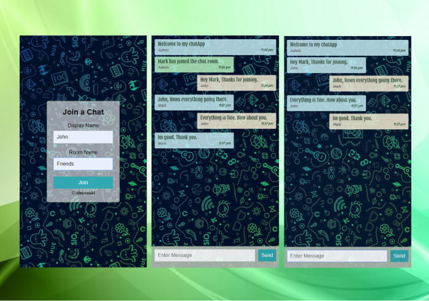

## Chat App

> This is a basic chat app made by NodeJS. It uses a real-time bi-directional event-based communication using [Socket.io](https://www.npmjs.com/package/socket.io). The app can be simultaneously used within different devices as long as it remains with the same chat room.

[View it live from your browser.](https://aiman-chatapp.herokuapp.com/)<br>


> Things I learned in this project;
  * Set-up an basic express server.
  * How to make use a real-time bi-directional JS library called [Socket.io](https://www.npmjs.com/package/socket.io).
  * How to listen to events when users create or make chats inside the same channel.
  * Abstract time using momentjs. 
  * Validate the output data if it matches the expected data type using Expect.

  > References:
  * [ExpressJS](https://github.com/expressjs/express). 
  * [Moment](https://www.npmjs.com/package/moment). 
  * [Socket.io](https://www.npmjs.com/package/socket.io). 
  * [Nodemon](https://www.npmjs.com/package/nodemon). 
  * [Expect](https://github.com/mjackson/expect). 

## Installation

Download the repo with:

```bash
$ git clone https://github.com/Aimanski12/my-app.git proj-name
```

After downloading the repo you can cd into the `proj-name` and then open up your console and type 

```bash
$ npm install
```

this will install all the application modules. Then type 

```bash
$ npm start
```

after this run the application with the live-server. All the assets are already included so you can run the application and it will work. 

## Contributing

If you find bugs with this project, pull requests are always welcome. You can [create an issue here](https://github.com/Aimanski12/Javascript_Projects/issues/new).
Your :sparkles: are also greatly appreciated.

[View other projects](http://bit.ly/aiman-javascript-projects)

## Author

[Aimanski](http://bit.ly/aiman-profile-github).

## License 

Copyright © 2019, [Aimanski12](http://bit.ly/aiman-profile-github).
Released under the [MIT License](LICENSE).

